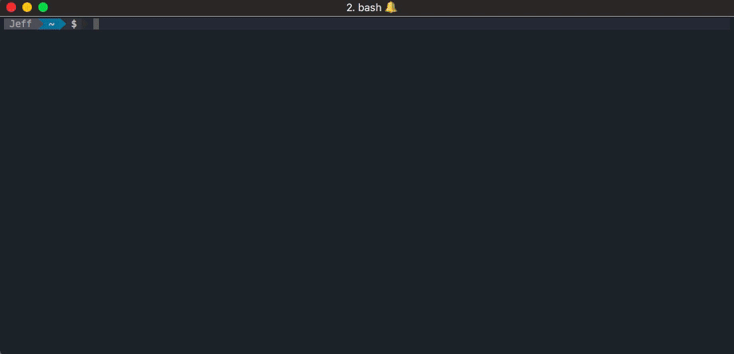

# Docker-Alertd

[](https://travis-ci.org/deltaskelta/docker-alertd)

## What Does It Do?



docker-alertd monitors docker containers on a host machine and sends alerts via email when
usage limits have been breached.

#### Currently, alerts can be sent based on:

1. Container existence (regardless of running state)
2. Running state (running or existed)
3. Memory usage (in MB)
4. CPU Usage (as a percentage)
5. Minimum Process running in container

# Step 1: Install

### Method: Build from source

Assuming that you already have `go` installed on your machine, you can just `go get` it.

```
go get github.com/deltaskelta/docker-alertd
```

#### If you would like to download a pre-compiled binary, head to the release downloads

[latest release - precompiled binary download](https://github.com/deltaskelta/docker-alertd/releases/latest)

# Step 2: Make a Configuration File

Docker-Alertd needs a configuration file in order to run, it will search the directory
which contains the binary, and the home directory for a config file automatically. A
special config file location can be specified with the `--config` flag.

#### A base config file can be generated with the command:

```
docker-alertd initconfig -d /path/to/config/location/
```

#### Example `.docker-alertd.yaml` file
```yaml
---
# The duration and interations settings, if omitted, have a default value of 100ms between
# docker API calls and an indefinite number of iterations which will run the monitor forever
#duration: 100				# duration in ms between docker API calls
#iterations: 0				# number of iterations to run

# 'containers' is an array of dictionaries that each contain the name of a container to
# monitor, and the metrics which it should be monitored by. If there are no metrics
# present, then it will just be monitored to make sure that is is currently up.

# This will monitor only that the container exists, running or not...
# containers:
#   - name: mycontainer

containers:
  - name: container1
    expectedRunning: true

  - name: container2
    expectedRunning: true
    maxCpu: 20
    maxMem: 20
    minProcs: 4

# If email settings are present and active, then email alerts will be sent when an alert
# is triggered.
emailSettings:
  active: true
  smtp: smtp.someserver.com
  password: s00p3rS33cret
  port: 587
  from: auto@freshpowpow.com
  subject: "DOCKER_ALERTD"
  to:
    - jeff@gnarfresh.com
```

### Configuration Variables

#### Containers

`duration`: the duration to wait between docker engine API calls.

`iterations`:  the number of iterations that docker-alertd should run (0 = run forever)

`name`: the container name or ID

`maxCpu`: the maximum cpu usage threshold (as a percentage), if the container uses more
CPU, an alert will be triggered.

`maxMem`: the maximum memory usage threshold (in MB). If the container uses more system
memory than this, an alert will be triggered.

`minProcs`: the minimum number of running processes (PID's) in the container. If a the
number of running processes dips below this level (when a process fails), an alert will
be triggered.

#### Email Settings

`active`: whether email settings are active or not

`smtp`: the smtp server to connect to

`password`: the password to use for smtp authentication

`port`: the port to connect to the smtp server

`from`: the email address to send from

`subject`: the subject line of emails sent

`to`: an array of email addresses to send the alerts to

#### Slack Settings

`webhookURL`: the webhookURL provided by slack after you authorize an app on a slack
channel. See [slack apps](https://api.slack.com/apps)

# Step 3: Run the program

Assuming `docker-alertd` is in your system path, and the config file is in the home
directory or the same directory as the binary...
```
$ docker-alertd
```

if the binary is not on your `$PATH` then you will have to pass absolute paths.
```
$ /path/to/binary/docker-alertd --config ~/path/to/configuration/file/.docker-alertd.yaml
```

This will start the program and log the output to stdout. It can be stopped with CTRL-C.

#### Example Output:

```
2017/09/18 12:11:44 starting docker-alertd
------------------------------
2017/09/18 12:11:44 ALERT:
2017/09/18 12:11:44 container1: Existence check failure: Error: No such container: container1
2017/09/18 12:11:44 container2: Existence check failure: Error: No such container: container2
...
```

# Step 4. Set up as a background process (optional)

If you wish to have docker-alertd run as a background process, it needs to be setup as a
background process as per your operating system.

### As A Systemd Service (for Linux systems with systemd)

If you have a systemd based system then you can refer to [docker-alertd.service.example](https://github.com/deltaskelta/docker-alertd/blob/master/docker-alertd.service.example)
the example systemd service file and this [tutorial](https://www.digitalocean.com/community/tutorials/how-to-use-systemctl-to-manage-systemd-services-and-units)

### With Launchd (MacOS)

Refer to the [launchd plist example file](https://github.com/deltaskelta/docker-alertd/blob/master/com.github.docker-alertd.plist.example) file and the [launchd reference](http://www.launchd.info/)

### With Sys V Init (various Linux systems without systemd)

Refer to this [Sys V Init tutorial](https://www.cyberciti.biz/tips/linux-write-sys-v-init-script-to-start-stop-service.html)

### Within docker

If you want to run `docker-alertd` from within Docker, you can do that. This requires
mounting the docker socket into the container which comes with security risks because the
container has access to the docker socket and therefore if it was compromised, it would
have root access on the system [google - mounting docker socket security](https://www.google.co.kr/search?q=mounting+docker+socket+secuity).

That being said if you decide it is something you want to do in development or in a
controlled production environment, you can use the image on the docker registry.

pull the image frm the registry

```bash
docker pull deltaskelta/docker-alertd

#or if you want to build your own tagged image, clone the repo and run
#docker build -t [your-tag] .
```

run the command to get a config file printed to stdout. You must save it, modify it to fit
your needs, and then mount it into the container that will run `docker-alertd`.

NOTE: `go-wrapper run` is equivalient to `docker-alertd` if the binary was installed
normally, so all of `docker-alertd`s normal commands will follow `go-wrapper run`

```bash
docker run --rm  deltaskelta/docker-alertd go-wrapper run initconfig --stdout
```

and then run the app with the mounted config file and the mounted docker socket.

```bash
docker run --rm -v /var/run/docker.sock:/var/run/docker.sock -v ~/.docker-aled.yaml:/root/.docker-alertd.yaml deltaskelta/docker-alertd
```

### Testing Alert Authentication

Docker-Alertd comes with a `testalert` command which will search for a nonexistant
container name and send an alert to the appropriate places, use this for testing that
smtp or other authentication settings are correct
